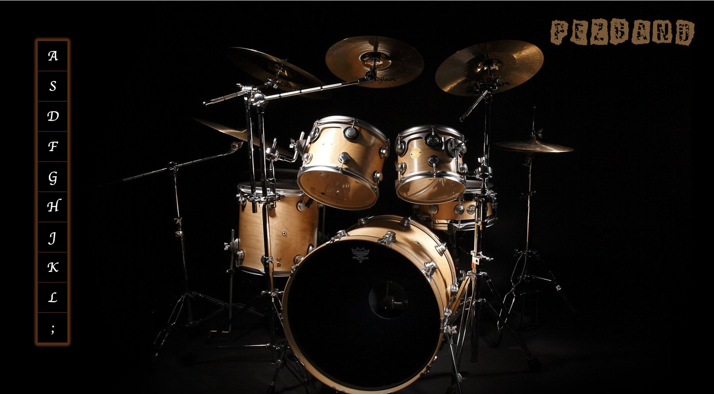

# JS30
Build 30 vanilla JS apps in 30 days

#### 01 Drumset

#### 02 Clock

#### 03 CSS Variables (animation control)

#### 04 Array Cardio (filter, reduce, from, map, sort)

#### 05 Flex gallery

#### 06 Canvas Drawing

#### 07 Shift checkboxes

#### 08 Audio Player

